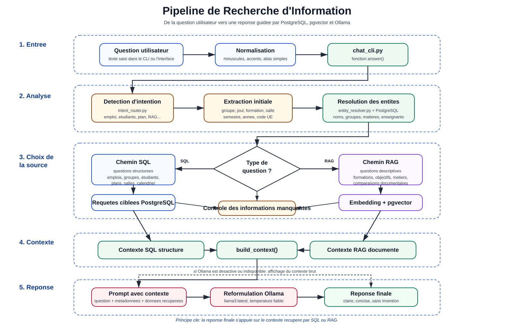
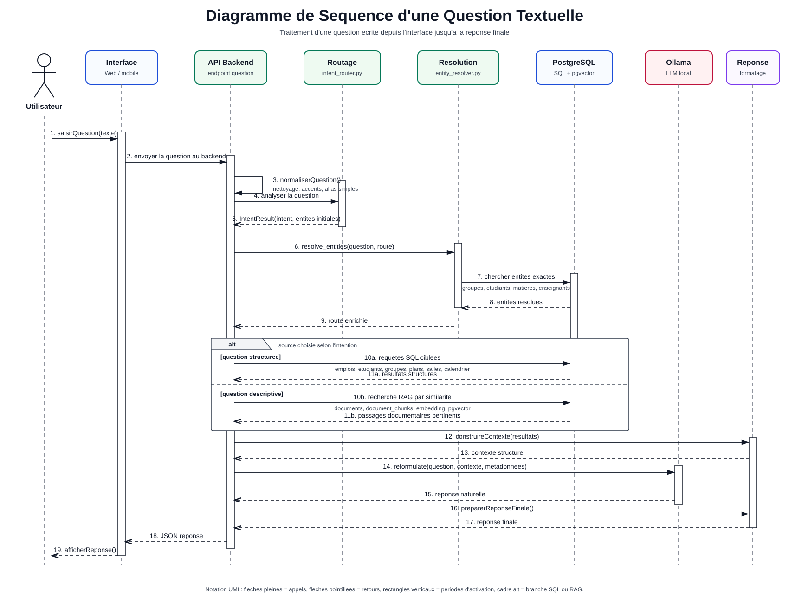
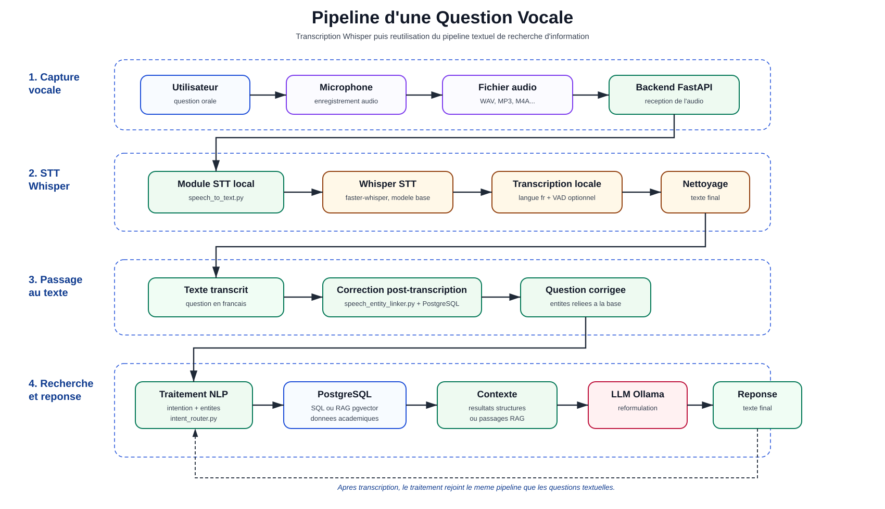
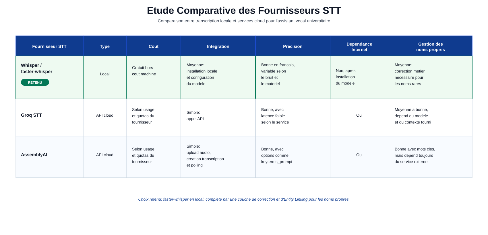
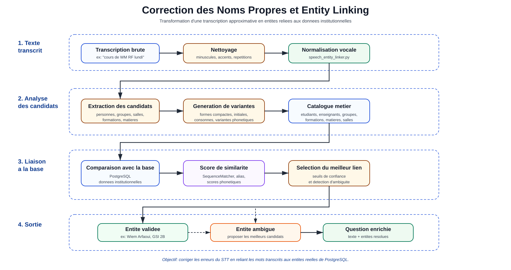
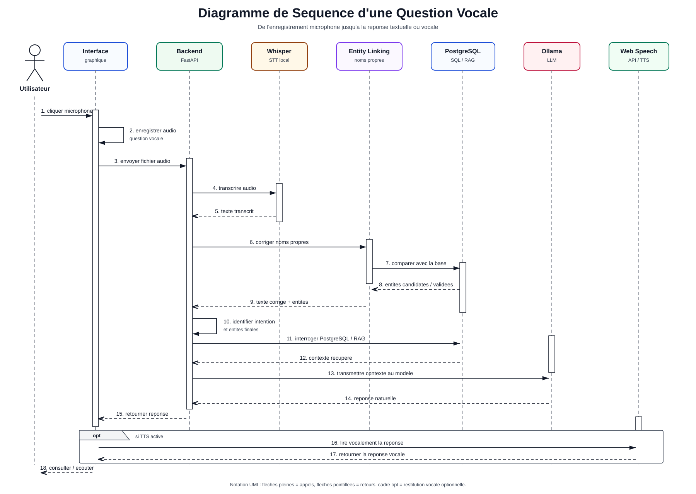
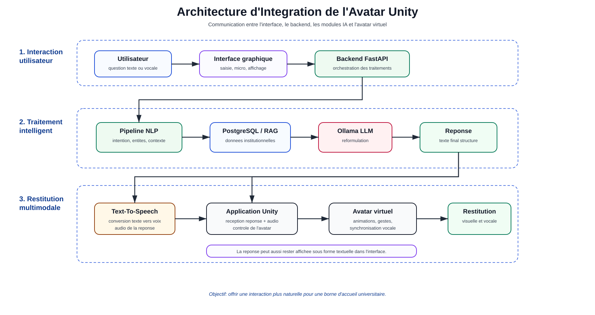
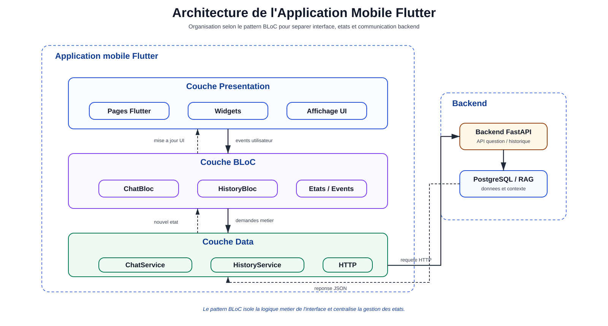

# Rapport du Projet PFA1

## Chatbot Intelligent Universitaire

### 1. Introduction

Ce projet consiste a concevoir un chatbot intelligent destine a un environnement universitaire. Il vise a assister les etudiants, les enseignants et l'administration dans l'acces rapide aux informations academiques.

L'idee generale du projet est de permettre a l'utilisateur de poser une question en langage naturel, puis de recevoir une reponse pertinente a partir des donnees de l'universite. Le projet commence par une version text-to-text, puis evolue progressivement vers une version vocale avec Speech-To-Text, Text-To-Speech et avatar Unity.

La strategie adoptee consiste a construire d'abord un moteur textuel robuste avant d'ajouter les couches vocales et graphiques. Ce choix permet de valider la qualite des donnees, la comprehension des questions et la pertinence des reponses avant de traiter les difficultes liees a la voix.

### 2. Objectifs du projet

Les objectifs principaux sont:

- fournir un assistant universitaire capable de repondre en francais;
- interroger les emplois du temps, les groupes, les etudiants, les matieres, les enseignants, les salles et le calendrier;
- exploiter des donnees structurees avec PostgreSQL;
- exploiter des documents textuels avec une approche RAG;
- utiliser un LLM local via Ollama pour la reformulation;
- preparer l'integration vocale avec Speech-To-Text;
- preparer l'evolution future vers une interface graphique et un avatar Unity.

### 3. Technologies utilisees

Le projet utilise principalement:

- Python pour les scripts d'ingestion, de routage, de resolution d'entites et de dialogue;
- PostgreSQL pour le stockage relationnel;
- pgvector pour la recherche vectorielle;
- Ollama pour executer le LLM localement;
- llama3:latest comme modele de reformulation;
- embeddinggemma comme modele d'embedding;
- faster-whisper pour une premiere version locale du STT;
- Gemini et AssemblyAI comme pistes de STT externe;
- openpyxl pour lire les fichiers Excel;
- psycopg pour communiquer avec PostgreSQL;
- requests pour les appels HTTP;
- PowerShell comme environnement de test.

### 4. Architecture generale

L'architecture est hybride. Elle combine:

- un chemin SQL pour les questions structurees;
- un chemin RAG pour les questions textuelles ou descriptives;
- un LLM local pour reformuler les reponses;
- une couche STT separee pour transformer la voix en texte;
- une future couche TTS et avatar Unity.

Le pipeline global est:

```text
Question utilisateur
-> texte ou voix
-> transcription si necessaire
-> normalisation
-> detection de l'intention
-> resolution des entites
-> choix du chemin SQL ou RAG
-> construction du contexte
-> reformulation eventuelle avec LLM
-> reponse finale
```

### 5. Donnees du projet

Les donnees sont placees dans le dossier `Data`. Elles contiennent plusieurs types d'informations:

- descriptions des formations;
- emplois du temps;
- plans d'etudes;
- calendrier universitaire;
- listes d'etudiants;
- emails;
- documents PDF et Excel.

Les donnees du projet sont separees en deux grandes categories:

- donnees structurees: emplois du temps, groupes, etudiants, calendrier, plans d'etudes;
- donnees textuelles: descriptions des formations et documents explicatifs.

Cette separation est importante car les donnees structurees sont interrogees avec des requetes SQL ciblees, tandis que les donnees textuelles sont traitees avec une approche RAG.

Un travail important a ete effectue pour gerer la variabilite des noms. Par exemple:

- `gsi` designe l'infotronique;
- `info` designe l'informatique;
- `meca` designe la mecatronique;
- `gsil` ou `indus` designe le genie industriel;
- en troisieme annee industrielle, les groupes sont divises en `LOG`, `MSPS` et `Q&M`.

### 6. Base de donnees

La base de donnees s'appelle `pfa1`. Elle repose sur PostgreSQL avec l'extension pgvector.

Les tables principales sont:

- `formations`;
- `niveaux`;
- `semestres`;
- `groupes`;
- `etudiants`;
- `emplois_temps`;
- `unites_enseignement`;
- `matieres`;
- `evenements_calendrier`;
- `documents`;
- `document_chunks`.

La table `document_chunks` contient une colonne:

```sql
embedding VECTOR(768)
```

Elle permet de stocker les embeddings produits par `embeddinggemma`.

### 7. Ingestion des donnees

L'ingestion est geree par:

```text
scripts/ingest_data.py
```

Ce script lit les donnees depuis le dossier `Data`, les normalise, puis les insere dans PostgreSQL.

Il prend en charge:

- la creation des formations;
- la creation des niveaux et semestres;
- l'insertion des groupes;
- l'insertion des etudiants;
- l'insertion des emplois du temps;
- l'insertion des plans d'etudes;
- l'insertion du calendrier;
- l'insertion des documents et chunks;
- la generation des embeddings si Ollama est disponible.

Pour les descriptions des formations, le traitement suit un chemin specifique:

```text
fichiers texte de description
-> nettoyage du contenu
-> insertion dans documents
-> decoupage en chunks
-> generation des embeddings
-> insertion dans document_chunks
-> recherche semantique avec pgvector
```

Ces descriptions ne sont donc pas utilisees comme de simples colonnes SQL. Elles deviennent une base documentaire interrogeable par similarite semantique.

Le script ignore actuellement le plan d'etudes de la formation industrielle, selon la decision prise pendant le developpement, mais conserve bien la formation industrielle dans les autres donnees.

### 8. Pipeline Text-To-Text

Le coeur actuel du projet est le pipeline text-to-text.

Il est compose de plusieurs modules:

- `chat_cli.py`;
- `intent_router.py`;
- `entity_resolver.py`;
- `ollama_client.py`.

#### 8.1 Interface CLI

Le fichier:

```text
scripts/chat_cli.py
```

permet de tester le chatbot dans le terminal.

Commande de test:

```powershell
python scripts/chat_cli.py --debug --no-llm
```

Cette commande teste la logique SQL sans reformulation LLM.

Commande avec LLM:

```powershell
python scripts/chat_cli.py --debug
```

#### 8.2 Detection de l'intention

Le fichier:

```text
scripts/intent_router.py
```

detecte le domaine de la question:

- emploi du temps;
- etudiants;
- groupes;
- plan d'etudes;
- calendrier;
- salles;
- enseignants;
- description de formation.

Il extrait aussi certaines informations visibles:

- groupe;
- jour;
- semestre;
- annee;
- formation;
- salle;
- code UE.

#### 8.3 Resolution des entites

Le fichier:

```text
scripts/entity_resolver.py
```

complete l'analyse de la question en utilisant PostgreSQL. Il permet par exemple de:

- retrouver le groupe d'un etudiant;
- resoudre un groupe ecrit sous plusieurs formes;
- faire le lien entre une matiere et ses alias;
- distinguer les enseignants;
- enrichir une question avec la formation et l'annee.

Exemple:

```text
Question: Wiem Arfaoui est dans quel groupe ?
Resultat: GSI 2B
```

#### 8.4 Pipeline de recherche d'information

Le pipeline de recherche d'information represente l'enchainement complet des traitements effectues entre la question utilisateur et la reponse finale. Dans ce projet, il combine la comprehension de la question, l'extraction et la correction des entites, la recuperation des donnees dans PostgreSQL ou dans la base RAG, puis la reformulation de la reponse par le modele de langage local.



**Figure 4.1 : Pipeline de traitement d'une question textuelle**

Le fonctionnement general du pipeline est le suivant:

1. L'utilisateur saisit une question en langage naturel.
2. La question est normalisee afin de faciliter la detection des mots cles, des alias et des entites.
3. Le module `intent_router.py` detecte l'intention de la question: emploi du temps, etudiants, groupes, plan d'etudes, calendrier, salles, enseignants ou description de formation.
4. Les entites visibles sont extraites: groupe, formation, jour, semestre, annee, salle, matiere ou code UE.
5. Le module `entity_resolver.py` complete et corrige ces entites en s'appuyant sur PostgreSQL. Il peut par exemple retrouver le groupe reel d'un etudiant, corriger une forme abregee de groupe ou rapprocher une matiere avec son nom exact dans la base.
6. Le systeme choisit la source de recherche:
   - chemin SQL pour les donnees structurees comme les emplois du temps, les etudiants, les groupes, les enseignants, les salles, les plans d'etudes et le calendrier;
   - chemin RAG pour les questions descriptives portant sur les formations, les objectifs, les debouches ou les comparaisons entre formations.
7. Un contexte structure est genere a partir des resultats SQL ou des passages documentaires retrouves avec `pgvector`.
8. Ce contexte, accompagne de la question et de quelques metadonnees, est transmis au modele local via `ollama_client.py`.
9. Le modele reformule la reponse en francais clair, sans inventer d'informations en dehors du contexte fourni.
10. La reponse finale est affichee a l'utilisateur. Si Ollama est desactive ou indisponible, le systeme peut afficher directement le contexte brut recupere depuis la base.

Cette architecture permet de combiner la fiabilite des donnees structurees avec la souplesse du langage naturel. La reponse est guidee par les donnees reellement presentes dans PostgreSQL ou dans les chunks documentaires de la base RAG, puis reformulee de maniere claire pour l'utilisateur.

#### 8.5 Diagramme de sequence d'une question textuelle

Le diagramme de sequence permet de representer les echanges entre les differents composants du systeme lors du traitement d'une question textuelle. Il montre l'ordre chronologique des appels, les retours de donnees et les composants actives pendant le traitement.



**Figure 4.2 : Diagramme de sequence d'une question textuelle**

Dans le cas d'une question ecrite, les principaux elements impliques sont:

- l'utilisateur;
- l'interface web ou mobile;
- l'API backend;
- le module de routage des intentions;
- le module de resolution des entites;
- la base PostgreSQL, incluant les tables relationnelles et `pgvector`;
- le modele de langage local via Ollama;
- le module de construction et de formatage de la reponse.

Le scenario general est le suivant:

1. L'utilisateur saisit une question depuis l'interface.
2. L'interface transmet la question au backend.
3. Le backend normalise la question avant l'analyse.
4. Le module `intent_router.py` detecte l'intention et extrait les premieres entites visibles.
5. Le module `entity_resolver.py` complete les entites en consultant PostgreSQL.
6. Le backend choisit le chemin de recuperation selon l'intention:
   - requetes SQL ciblees pour les informations structurees;
   - recherche RAG avec `document_chunks`, embeddings et `pgvector` pour les descriptions de formations.
7. Les resultats recuperes sont transformes en contexte structure.
8. Le contexte, la question et les metadonnees sont transmis a Ollama.
9. Ollama reformule une reponse naturelle a partir du contexte fourni.
10. Le module de reponse prepare le resultat final.
11. Le module de reponse renvoie la reponse finale au backend.
12. Le backend renvoie la reponse a l'interface.
13. L'utilisateur consulte la reponse affichee.

Ce diagramme respecte la logique UML d'un diagramme de sequence: les composants sont representes par des lignes de vie, les traitements actifs par des rectangles d'activation, les appels par des fleches continues et les retours par des fleches pointillees. Le fragment `alt` represente le choix entre le chemin SQL et le chemin RAG selon la nature de la question.

### 9. Gestion des questions structurees

Pour les questions structurees, le systeme utilise des requetes SQL ciblees. Il ne lit pas toutes les tables. Il selectionne uniquement les informations necessaires selon les filtres detectes.

Exemples:

```text
Quel est l'emploi du temps de GSI 2B lundi ?
```

Le systeme cherche uniquement les seances du groupe `GSI 2B` le lundi.

```text
Donner la liste de GSI 2B
```

Le systeme cherche uniquement les etudiants du groupe `GSI 2B`.

```text
Quand enseigne Zgarni ?
```

Le systeme cherche uniquement les lignes d'emploi du temps liees a cet enseignant.

### 10. Gestion des donnees textuelles et RAG

Les questions descriptives sont traitees avec une approche RAG. Cette partie concerne surtout les descriptions des formations et les documents textuels.

Le chemin RAG utilise:

- `documents`;
- `document_chunks`;
- `embeddinggemma`;
- `pgvector`;
- Ollama.

Les descriptions des formations sont des donnees non structurees. Elles ne sont pas interrogees comme les emplois du temps ou les groupes. Le systeme ne cherche pas une ligne exacte dans une table metier. Il cherche plutot les passages les plus pertinents dans les chunks documentaires.

Exemples de questions RAG:

```text
Presente-moi la formation informatique.
Quels sont les objectifs de l'infotronique ?
Quels sont les debouches de la mecatronique ?
Quelle est la difference entre informatique et infotronique ?
```

Le principe est:

```text
question
-> embedding
-> recherche semantique dans pgvector
-> recuperation du contexte pertinent
-> reformulation avec LLM
```

Dans ce cas, le LLM ne recoit pas toute la base documentaire. Il recoit seulement les chunks les plus pertinents retrouves par pgvector. Cela permet de produire une reponse explicative tout en limitant les hallucinations.

Le traitement des descriptions de formation peut etre resume ainsi:

```text
Question descriptive utilisateur
-> embedding de la question
-> recherche vectorielle dans document_chunks
-> recuperation des passages pertinents
-> construction du contexte documentaire
-> reponse en francais avec le LLM
```

### 11. LLM local

Le projet utilise Ollama pour executer un modele local.

Configuration:

```env
OLLAMA_BASE_URL=http://localhost:11434
OLLAMA_LLM_MODEL=llama3:latest
OLLAMA_EMBEDDING_MODEL=embeddinggemma
```

Le LLM ne doit pas decider seul des donnees. Le systeme recupere d'abord le contexte depuis SQL ou RAG, puis le LLM reformule en francais.

Cette separation limite les hallucinations et rend le systeme plus fiable.

### 12. Speech-To-Text

L'integration du Speech-To-Text permet a l'utilisateur de poser une question oralement au lieu de la saisir manuellement. Cette fonctionnalite est particulierement utile dans un contexte d'assistant universitaire, car elle rend l'interaction plus naturelle et plus rapide.

Dans notre solution, nous avons retenu Whisper pour la transcription vocale. Developpe par OpenAI, ce modele de reconnaissance vocale offre de bonnes performances de transcription tout en prenant en charge plusieurs langues et differents accents. Son utilisation permet aussi de conserver une plus grande maitrise des donnees vocales par rapport a certaines solutions entierement basees sur des services cloud.



**Figure 5.1 : Pipeline d'une question vocale**

Le fonctionnement general est le suivant:

1. L'utilisateur clique sur le bouton microphone dans l'interface.
2. L'audio est enregistre puis transmis au backend.
3. Le backend traite l'enregistrement avec le module Speech-To-Text base sur Whisper.
4. Le modele `faster-whisper` produit une transcription textuelle de la question.
5. Le texte transcrit est nettoye afin de supprimer certaines repetitions ou erreurs simples.
6. Le texte obtenu peut etre corrige et relie aux entites de la base avec `speech_entity_linker.py`.
7. La question transcrite rejoint ensuite le meme pipeline que les questions ecrites: detection de l'intention, resolution des entites, recherche SQL ou RAG, construction du contexte, reformulation par Ollama et affichage de la reponse.

L'integration de Whisper s'inscrit naturellement dans l'architecture de l'assistant intelligent. Une fois la transcription realisee, le texte est transmis aux modules de comprehension du langage et de recherche d'information afin de generer une reponse pertinente a partir des donnees institutionnelles de l'ENICarthage.

La partie STT reste separee du pipeline text-to-text: elle transforme la voix en texte. Une fois la transcription obtenue, le traitement redevient identique a celui d'une question textuelle.

Les fichiers concernes sont:

- `speech_to_text.py`;
- `speech_to_text_api.py`;
- `speech_to_text_assemblyai.py`;
- `stt_api_client.py`;
- `stt_assemblyai_client.py`;
- `speech_entity_linker.py`.

#### 12.1 STT avec Whisper

Le fichier:

```text
scripts/speech_to_text.py
```

utilise `faster-whisper`, une implementation optimisee de Whisper. Il peut transcrire un fichier audio existant ou enregistrer directement le microphone pendant une duree donnee.

Commande:

```powershell
python scripts/speech_to_text.py --record 5 --no-vad --link-db
```

Dans ce script, le modele par defaut est:

```text
model = base
language = fr
compute_type = int8
device = cpu
```

Le script applique aussi un prompt initial pour aider Whisper a conserver les codes de groupes comme `GSI`, `GSIL`, `INFO` et `MECA`. Apres transcription, l'option `--link-db` permet de relier le texte obtenu aux entites de PostgreSQL grace a `speech_entity_linker.py`.

#### 12.2 Pistes STT externes testees

Le fichier:

```text
scripts/speech_to_text_assemblyai.py
```

permet de tester AssemblyAI comme solution externe. Il accepte soit un fichier audio existant avec `--audio`, soit un enregistrement direct du microphone avec `--record`.

Commande:

```powershell
python scripts/speech_to_text_assemblyai.py --record 5 --link-db
```

Le flux AssemblyAI est:

```text
audio local
-> upload
-> creation transcription
-> polling
-> texte final
-> liaison avec la base
```

Le module:

```text
scripts/stt_assemblyai_client.py
```

gere les appels vers l'API AssemblyAI:

- lecture de `ASSEMBLYAI_API_KEY` depuis `.env`;
- upload du fichier audio;
- creation d'une transcription;
- attente du resultat par polling;
- recuperation du texte final;
- gestion des erreurs d'authentification, de quota, de rate limit et de timeout.

Le client utilise par defaut:

```text
language_code = fr
speech_model = universal-2
```

Il envoie aussi une liste de mots importants avec `keyterms_prompt`, par exemple `GSI`, `INFO`, `MECA`, `infotronique`, `emploi du temps`, certains noms d'etudiants et quelques matieres. Cette liste aide le service de transcription a mieux reconnaitre les termes propres au contexte universitaire du projet. Cette piste reste utile pour comparaison, meme si le pipeline principal de la solution est base sur Whisper.

#### 12.3 Etude comparative des fournisseurs STT

Plusieurs solutions de Speech-To-Text peuvent etre utilisees dans un assistant vocal. Parmi les possibilites etudiees, on distingue les solutions locales et les solutions basees sur des API cloud. Les solutions locales, comme Whisper ou `faster-whisper`, ont l'avantage de fonctionner directement sur la machine sans envoyer l'audio vers un service externe. Elles offrent donc un meilleur controle sur les donnees et conviennent mieux a un contexte universitaire ou la confidentialite est importante. Cependant, elles necessitent des ressources materielles suffisantes, notamment en memoire et en puissance de calcul.

Les solutions cloud, comme AssemblyAI ou Groq, sont plus simples a integrer et ne demandent pas de ressources importantes sur la machine locale. En revanche, elles dependent d'une connexion Internet, d'un fournisseur externe et peuvent poser des contraintes liees a la confidentialite des donnees vocales.

Dans notre cas, la solution retenue est `faster-whisper` en local. Ce choix permet de garder le traitement vocal dans l'environnement de l'application et de limiter la dependance a des services externes. Le modele utilise est configure pour la langue francaise et execute localement sur CPU avec une optimisation en `int8`, afin de reduire la consommation de ressources.

Neanmoins, certains problemes persistent sur la transcription des noms propres, surtout lorsque les noms sont d'origine arabe ou peu frequents dans les modeles de langue generaux. Pour cette raison, une couche supplementaire de correction et d'Entity Linking a ete ajoutee afin de relier les transcriptions approximatives aux entites reelles presentes dans la base de donnees.



**Figure 5.2 : Comparaison des fournisseurs STT etudies**

#### 12.4 Correction post-transcription

La transcription vocale brute ne suffit pas toujours pour obtenir une question exploitable. Le principal probleme rencontre concerne les noms propres, notamment les noms d'etudiants, d'enseignants ou de groupes. Ces noms peuvent etre mal transcrits par le modele STT.

Par exemple, une question comme:

```text
Quel cours a Wiem Arfaoui le lundi ?
```

peut etre transcrite de maniere incorrecte si le modele ne reconnait pas correctement le prenom ou le nom. Cela peut empecher le systeme de retrouver l'etudiante correspondante dans la base de donnees.

Pour resoudre ce probleme, une couche de correction a ete ajoutee apres la transcription. Elle compare les mots detectes avec les donnees institutionnelles stockees dans la base: etudiants, enseignants, groupes, formations, matieres et salles. Le systeme utilise des techniques de normalisation et de recherche approximative afin de retrouver l'entite la plus probable.

Cette etape permet de lier une expression mal transcrite a une entite reelle de la base. C'est ce qu'on appelle l'Entity Linking. Grace a cette approche, le systeme ne depend pas uniquement de la qualite du STT, mais peut corriger certaines erreurs a partir de ses propres donnees.



**Figure 5.3 : Processus de correction des noms propres et Entity Linking**

Le fichier:

```text
scripts/speech_entity_linker.py
```

corrige les erreurs de transcription en s'appuyant sur la base.

Il permet de rapprocher:

- un nom mal transcrit avec un etudiant;
- un groupe mal transcrit avec un groupe reel;
- une matiere mal transcrite avec une matiere de la base;
- un enseignant mal reconnu avec un enseignant existant.

Exemple:

```text
WM-RF -> WIEM ARFAOUI
```

#### 12.5 Diagramme de sequence d'une question vocale

Le diagramme de sequence d'une question vocale permet de visualiser l'enchainement des echanges entre les composants depuis l'enregistrement audio jusqu'a la reponse finale.

Le scenario est le suivant:

1. L'utilisateur clique sur le bouton microphone.
2. L'interface enregistre la question vocale.
3. Le fichier audio est envoye au backend FastAPI.
4. Le backend transmet l'audio au module STT base sur Whisper.
5. Le texte transcrit est recupere.
6. Le systeme corrige les noms propres si necessaire avec la couche d'Entity Linking.
7. L'intention et les entites sont identifiees.
8. Le backend interroge PostgreSQL ou la base RAG selon le type de question.
9. Le contexte est transmis au modele de langage via Ollama.
10. La reponse est retournee a l'interface.
11. Si le TTS est active, la reponse est lue vocalement avec Web Speech API.
12. Le module TTS retourne la reponse vocale a l'interface.



**Figure 5.7 : Diagramme de sequence d'une question vocale**

### 13. Text-To-Speech et avatar Unity

L'une des particularites de notre solution est l'integration d'un avatar virtuel developpe avec Unity. L'objectif de cet avatar est de rendre l'interaction avec l'assistant universitaire plus naturelle, plus immersive et plus proche d'un veritable agent d'accueil humain.

Unity a ete choisi en raison de sa capacite a gerer des environnements 3D interactifs ainsi que l'animation de personnages virtuels. L'avatar represente visuellement l'assistant intelligent et constitue un moyen supplementaire de communiquer les reponses aux utilisateurs.

Le fonctionnement general repose sur une communication entre l'interface utilisateur, le backend FastAPI et l'application Unity. Lorsqu'une question est traitee par le systeme, la reponse generee est transmise a l'avatar. Celui-ci peut alors afficher des animations predefinies et accompagner la restitution de la reponse vocale produite par le module Text-To-Speech.

L'integration de l'avatar a pour objectif d'ameliorer l'experience utilisateur, notamment dans le cadre d'une borne d'accueil installee au sein de l'etablissement. En associant representation visuelle, synthese vocale et intelligence artificielle, l'utilisateur beneficie d'une interaction plus intuitive et engageante qu'un simple affichage textuel.



**Figure 5.4 : Architecture d'integration de l'avatar Unity**

Le flux cible peut etre resume ainsi:

```text
Utilisateur
-> Interface graphique
-> Backend FastAPI
-> PostgreSQL / RAG + Ollama
-> Reponse textuelle
-> Text-To-Speech
-> Unity Avatar
-> Restitution visuelle et vocale
```

Ces couches ne sont pas encore le centre du projet actuel. La priorite est de stabiliser la comprehension textuelle et vocale.

### 14. Architecture Flutter

L'application mobile est organisee selon le pattern BLoC, pour Business Logic Component. Ce choix permet de separer clairement l'interface utilisateur de la logique metier et de la communication avec le backend.

L'architecture est organisee en trois parties principales:

- Presentation: contient les pages et les widgets Flutter;
- BLoC: assure la gestion des evenements et des etats, par exemple `ChatBloc` et `HistoryBloc`;
- Data: contient les services responsables de la communication avec le backend FastAPI.

Cette separation facilite la maintenance de l'application et rend le code plus clair. L'interface envoie les actions utilisateur vers les BLoC, les BLoC appellent les services de la couche Data, puis les services communiquent avec le backend FastAPI. Les reponses du backend sont ensuite transformees en nouveaux etats pour mettre a jour l'interface.



**Figure 5.5 : Architecture de l'application mobile Flutter**

Le flux general peut etre resume ainsi:

```text
Couche Presentation
-> Couche BLoC
-> Couche Data
-> Backend FastAPI
```

### 15. Tests effectues

Plusieurs types de tests ont ete effectues:

- verification du schema SQL;
- verification des tables;
- ingestion des donnees;
- detection des intentions;
- resolution des groupes;
- resolution des etudiants;
- correction des alias de matieres;
- correction des enseignants combines;
- test de STT local;
- test de STT Gemini;
- debut de test AssemblyAI.

Exemples de tests text-to-text:

```text
Wiem Arfaoui est dans quel groupe ?
Quel cours a Wiem Arfaoui le lundi ?
Donner la liste de GSI 2B
Ou se deroule le cours de BUS de communication pour GSI2B ?
Quand enseigne Zgarni ?
```

### 16. Limites actuelles

Les limites principales sont:

- la reconnaissance vocale des noms propres reste difficile;
- les API externes peuvent avoir des quotas ou erreurs;
- le LLM local peut reformuler incorrectement si le contexte est trop long;
- la qualite des donnees influence directement la qualite des reponses;
- certaines donnees PDF peuvent necessiter un nettoyage plus avance;
- la securite et les droits d'acces ne sont pas encore traites en profondeur.

### 17. Perspectives d'evolution

Les prochaines etapes possibles sont:

- creer une interface graphique web;
- ajouter une authentification par role;
- ameliorer le RAG documentaire;
- ajouter un mode de confirmation pour les noms propres vocaux;
- integrer un TTS;
- connecter l'audio a un avatar Unity;
- ajouter des tests automatises;
- creer une API backend FastAPI;
- securiser les donnees sensibles.

### 18. Conclusion

Ce projet met en place les fondations d'un assistant universitaire intelligent. La partie text-to-text est deja structuree autour d'un pipeline robuste: detection d'intention, resolution d'entites, interrogation ciblee de la base et reformulation.

La base PostgreSQL permet de traiter les questions academiques structurees, tandis que pgvector et embeddinggemma preparent le traitement documentaire avec RAG.

La partie vocale est en cours d'integration avec plusieurs solutions STT. Le projet est donc evolutif et peut progressivement devenir un assistant vocal complet avec interface graphique, synthese vocale et avatar anime.
